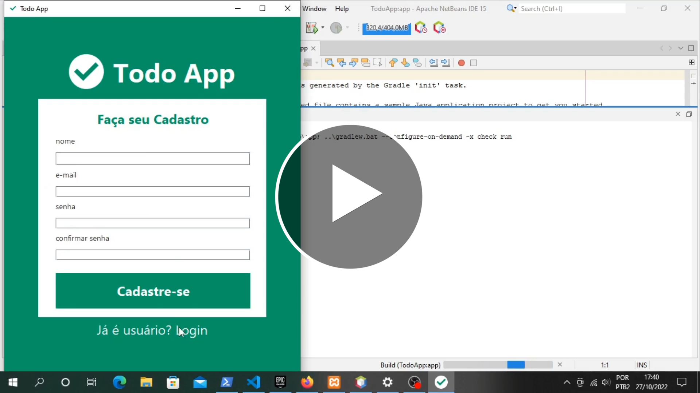

# Projeto-LA3-Capgemini-Start
Aplicação de lista de afazeres com java Swing e mysql - feito no curso LA3 disponibilizado no Programa Start da Capgemini, com o auxílio das aulas do professor [Marcio Michelluzzi](https://github.com/marciomichelluzzi/).

  

## Features
O projeto inclui um sistema de tags e tem até um esboço de autenticação, contando com as seguintes funcionalidades:
- Cadastro e login de Users;
- Cadastro de projetos;
- Cadastro, Remoção e Atualização de Tarefas;
- Cadastro de Tags.

## Como testar
 1. Executar o mysql server;
 2. Executar o projeto;
 3. Pronto!

Se você gostou, por favor favorite este repositório :smile: :star:
